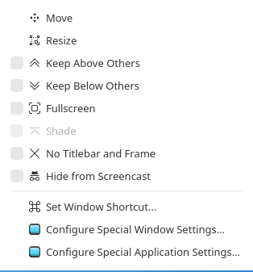

# 🔒 KWin Hide from Screencast

Backport of KDE Plasma 6.6's **"Hide from Screencast"** feature to **KWin 6.3.x**.

Allows you to exclude specific windows from screen sharing and recording - perfect for keeping sensitive information private during video calls, streaming, or screen recordings.


---

## 📸 Screenshots

| Menu Access | Option |
|-------------|--------|
|  |  |

**[🎬 Watch Demo Video](screenshots/demo.mp4)**

## ✨ Features

- **Hide any window from screen capture** - Right-click → More Actions → Hide from Screencast
- **Automatic propagation** - Child windows (dialogs, popups) inherit the exclusion setting
- **Zero performance impact** - Fast path when no windows are excluded
- **Works with all screen sharing tools** - OBS, Discord, Google Meet, Zoom, etc.

---

## 📋 Requirements

- **KDE Plasma 6.3.x** (tested on 6.3.6)
- **Wayland session**
- **Build dependencies** for KWin (see installation)

---

## 🚀 Installation

### Option 1: Apply Patch (Recommended)

```bash
# 1. Clone this repository
git clone https://github.com/henriquejsza/kwin-hide-from-screencast.git
cd kwin-hide-from-screencast

# 2. Download KWin source (match your version)
git clone https://invent.kde.org/plasma/kwin.git kwin-src
cd kwin-src
git checkout v6.3.6  # or your version

# 3. Apply the patch
git apply ../kwin-hide-from-screencast.patch

# 4. Install build dependencies (Arch/Manjaro)
sudo pacman -S --needed extra-cmake-modules wayland-protocols plasma-wayland-protocols \
    qt6-base qt6-wayland kf6-kconfigwidgets kf6-ki18n kf6-kglobalaccel \
    kdecoration kscreenlocker breeze

# 5. Build
mkdir build && cd build
cmake .. -DCMAKE_INSTALL_PREFIX=/usr -DCMAKE_BUILD_TYPE=Release
make -j$(nproc)

# 6. Install
sudo make install

# 7. Restart KWin
# Option A: Toggle compositor (Alt+Shift+F12 twice)
# Option B: Logout/Login
# Option C: Reboot
```

### Option 2: Manual Installation

See [MANUAL_INSTALL.md](MANUAL_INSTALL.md) for step-by-step file modifications.

---

## 📖 Usage

1. **Right-click** on any window's title bar
2. Go to **More Actions** → **Hide from Screencast**
3. The window will now be excluded from all screen captures

The setting persists for the session. Child windows (dialogs, pop-ups) automatically inherit the setting.

---

## 🔧 How It Works

This patch modifies KWin's screencast plugin to implement custom offscreen rendering:

1. **New Window Property**: Adds `excludeFromCapture` property to the `Window` class
2. **UI Integration**: Adds menu item in window context menu under "More Actions"
3. **Screencast Filter**: When capturing, checks for excluded windows and renders a filtered scene

### Files Modified

| File | Changes |
|------|---------|
| `src/options.h` | Added `ExcludeFromCaptureOp` enum |
| `src/window.h/cpp` | Added `excludeFromCapture` property |
| `src/useractions.h/cpp` | Added menu item and handler |
| `src/workspace.h` | Added slot declaration |
| `src/scripting/workspace_wrapper.h/cpp` | Added scripting support |
| `src/plugins/screencast/outputscreencastsource.cpp` | Added filtered rendering |
| `src/plugins/screencast/regionscreencastsource.cpp` | Added filtered rendering |

---

## ⚠️ Rollback

To restore the original KWin:

```bash
# Arch/Manjaro
sudo pacman -S kwin

# Then reboot or restart KWin
```

---

## 🤝 Contributing

This is a backport patch. The feature is available natively in KDE Plasma 6.6+.

For the official implementation, see:
- [KDE Invent MR !8442](https://invent.kde.org/plasma/kwin/-/merge_requests/8442)

---

## 📄 License

GPL-2.0-or-later (same as KWin)

---

## 🙏 Credits

- **Henrique José de Souza** ([@henriquejsza](https://github.com/henriquejsza)) - Backport implementation and custom screencast filter
- **KDE Team** - Original implementation in Plasma 6.6
